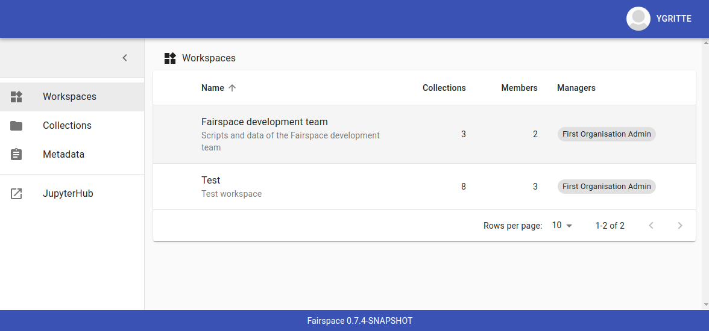
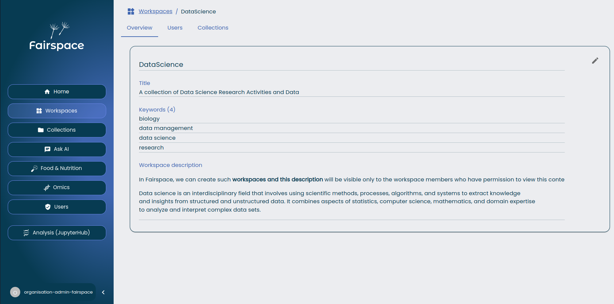
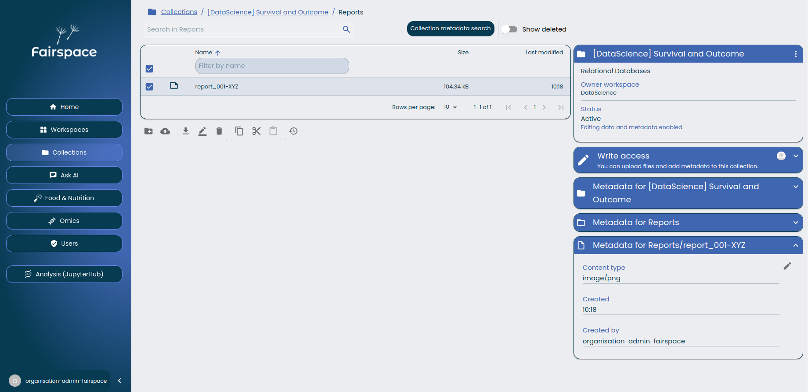
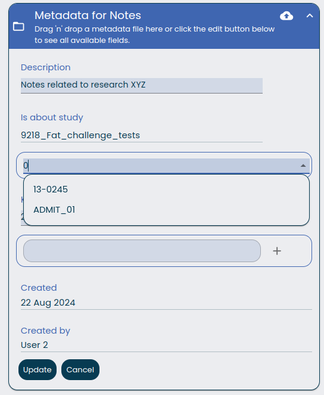
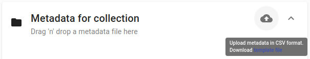
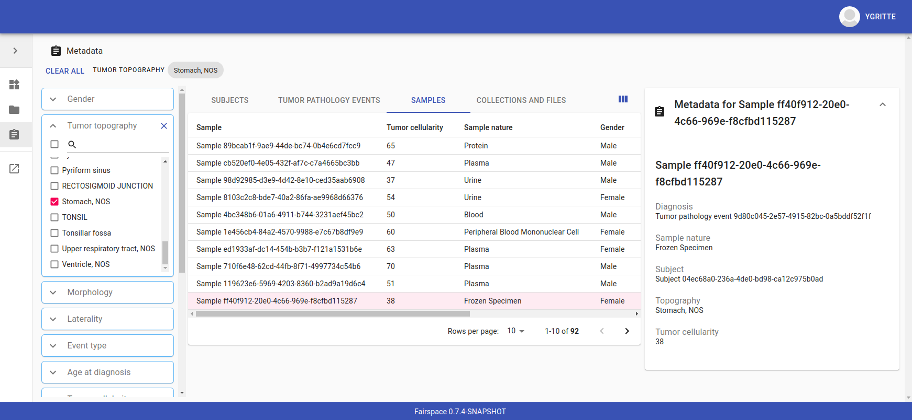
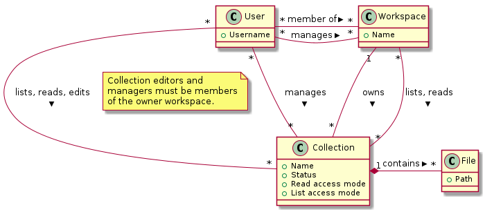
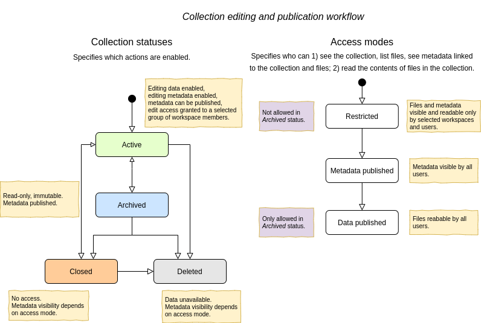
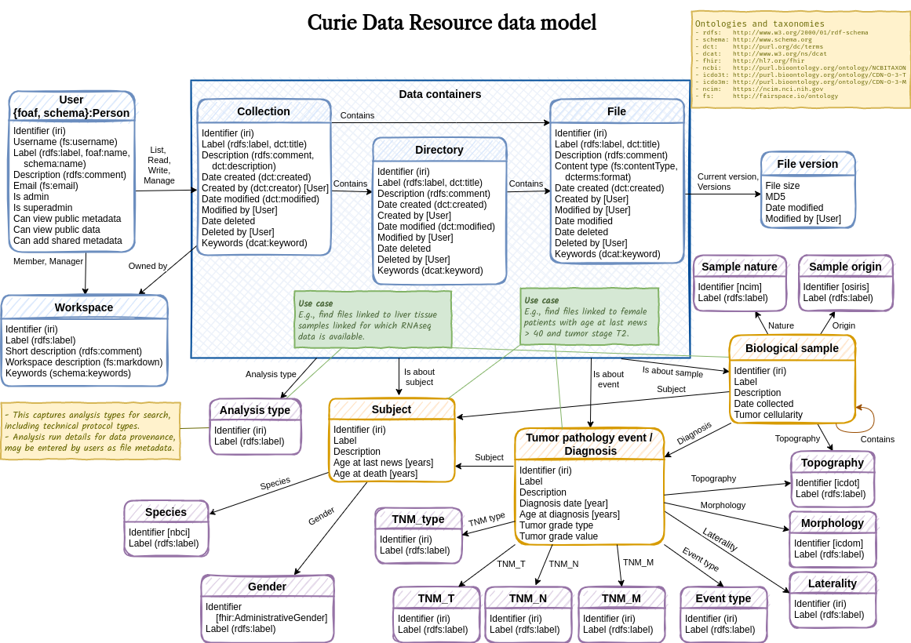

= Fairspace
:description: Fairspace documentation.
:doctype: book
:showtitle!:
:url-repo: https://github.com/fairspace/workspace
:source-highlighter: rouge
:toc: macro
:toclevels: 3
:toc-title: Table of contents

:Jena: https://jena.apache.org/
:RDF: https://en.wikipedia.org/wiki/Resource_Description_Framework
:SPARQL: https://www.w3.org/TR/sparql11-query/
:SHACL: https://www.w3.org/TR/shacl/
:Keycloak: https://www.keycloak.org/
:Keycloak_server_administration: https://www.keycloak.org/docs/latest/server_admin/
:JupyterHub: https://jupyterhub.readthedocs.io/
:FAIR: https://www.go-fair.org/fair-principles/
:WebDAV: https://en.wikipedia.org/wiki/WebDAV
:json-ld: https://json-ld.org/
:jsonld-schema: https://raw.githubusercontent.com/json-ld/json-ld.org/master/schemas/jsonld-schema.json
:turtle: https://www.w3.org/TR/turtle/
:n-triples: https://www.w3.org/TR/n-triples/

Fairspace is a secure place for managing research data.
Research teams have their own workspaces in which they
can manage research data collections.
Researchers can upload directories and files to data collections.
Data access is organised on data collection level.
Collections can be shared with other teams or individual researchers.
Also, collections can be published for all researchers in the organisation. +

Collections and files can be annotated with descriptive metadata.
The metadata is stored using the {RDF}[Resource Description Framework (RDF)] in
an {Jena}[Apache Jena] database.
For the metadata, a data model can be configured that suits
the data management needs of the organisation.
The data model is specified using the {SHACL}[Shapes Constraint Language (SHACL)],
see the section on <<Data model and view configuration>>.
Descriptive metadata entities (e.g., subjects, projects, samples) should be added to the database by a
careful process, ensuring that duplicates and inconsistencies are avoided and
all entities have proper unique identifiers.
The application provides overviews of the available metadata entities.
In the collection browser, researchers can link their collections and file to these entities
or add textual descriptions and key words.

.*Key features*
****

* Fairspace is a data repository that enables researchers to securely *store* and *organise* their research data sets,
and *share* the data with collaborators.
* Fairspace lets researchers annotate their data collections with relevant metadata properties
and link the data to associated metadata entities (subjects, samples, projects, etc.).
This helps researchers find their own data and make it *findable* for others,
contributing to implementation of the {FAIR}[FAIR principles].
* Fairspace ensures that all metadata entities have a unique identifier and validates
metadata consistency and validity upon data entry.
* Fairspace allows organisations to use *customise* the configured data model,
by specifying custom entity types and constraints.
This enables the adoption of community standards for metadata relevant for the research domain,
which contributes to the *reusability* of the data.
* Fairspace uses the {RDF}[Resource Description Framework (RDF)] and {WebDAV}[WebDAV] standards for data exchange,
and stimulates the uses of standard vocabularies,
contributing to *interoperability* of data.
****

toc::[]

== Usage

=== User interface

==== Login

Users are authenticated using {Keycloak}[Keycloak], an open-source identity provider
that provides secure authentication methods and can be configured to integrate
with institutional identity providers using user federation or identity brokering,
see the {Keycloak_server_administration}[Keycloak server administration] pages.

The user either logs in directly using Keycloak or is forwarded to a configured
external login:

==== Workspaces

Users enter Fairspace on the workspaces page that lists all workspaces.
A workspace represents a team in the organisation that collaborates on research data collections.

Workspace administrators can edit the workspace overview page and
manage workspace membership. All workspace members can add collections to the workspace.

==== Collections

The contents of collections can be navigated in the collections browser.
It behaves like a regular file browser. Click to select a directory or file
and see its metadata, double click to navigate into directories or
open a file.

Access is managed on collection level.
Users with at least write access to a collection can upload files or directories,
rename or delete files, restore old file versions,
and edit the associated metadata.

===== Metadata forms

Users with write access to the collection can annotate collections,
directories and files using _metadata forms_.
Free text fields, like description and key words, can be entered freely,
links to shared entities, like subjects, samples and projects, or
values from a controlled vocabulary, like taxonomy or analysis type,
can be selected from a list:

The shared metadata entities and controlled vocabularies cannot
be added via the user interface.
The <<RDF metadata>> API should be used for that instead.

===== Metadata upload

Another way to annotate directories and files is by uploading a comma-separated values (CSV) file with metadata.
This section describes the CSV-based format used for bulk metadata uploads.

The file should be a valid CSV-file:

* Records are separated with a ``,``-character.
* Values may be enclosed in double quotes: ``"value"``.
* In values that contain a double, the double quotes need to be escaped by replacing them with double double quotes:
``Example "quoted" text`` becomes ``"Example ""quoted"" text"``.

In the metadata upload, lines starting with ``#`` are ignored. These lines are considered to be comments.

The file should have a header row containing the names of the columns.
The mandatory ``Path`` column is used for the file path. For the property columns, the name should match exactly the name of the property in the database.

The format of the values is as follows:

* _Path_: the relative path to a file or a directory (relative to the collection or directory where the file is uploaded).
Use ``./`` for the current directory or collection.
* _Entity types_ can be referenced by ID or unique label.
* Multiple values must be separated by the pipe symbol ``|``, e.g.,
use ``test|lab`` to enter the values ``test`` and ``lab``.

The file can be uploaded to the current directory by dropping the file in the metadata panel of the directory, or by selecting the metadata upload button. +
By hovering over the metadata upload button, a link to a _metadata template file_ becomes available:

The file describes the format in commented lines and
contains the available properties in the header row.

.Example metadata file
====
An example comma-separated values file with metadata about the current directory ``./``,
which is annotated with a description and two key words (``sample`` and ``lab``),
and the file ``test.txt`` which is linked to Subject 1 by the unique subject label
and to the RNA-seq analysis type by the analysis type identifier (``O6-12``).
[source, csv]
----
Path,Is about subject,Type of analysis,Description,Keywords
./,,,Directory with samples,sample|lab,
test.txt,Subject 1,https://institut-curie.org/analysis#O6-12,,
----
This specified the table:
[%header,format=csv]
|===
Path,Is about subject,Type of analysis,Description,Keywords
./,,,Directory with samples,sample|lab,
test.txt,Subject 1,https://institut-curie.org/analysis#O6-12,,
|===
====

==== Metadata

Explore metadata and find associated collections and files.

=== Interfaces for accessing and querying data (API)

==== Authentication

===== OpenID Connect (OICD) / OAuth2 workflow

Via header, via session.

.Fetch token (Python code example)
[%collapsible]
====
[source, python]
----
import logging
import requests
import sys
import time

log = logging.getLogger()

def fetch_access_token(keycloak_url: str,
                       realm: str,
                       client_id: str,
                       client_secret: str,
                       username: str,
                       password: str) -> str:
    """
    Obtain access token from Keycloak
    :return: the access token as string.
    """
    params = {
        'client_id': client_id,
        'client_secret': client_secret,
        'username': username,
        'password': password,
        'grant_type': 'password'
    }
    headers = {
        'Content-type': 'application/x-www-form-urlencoded',
        'Accept': 'application/json'
    }
    response = requests.post(f'{keycloak_url}/auth/realms/{realm}/protocol/openid-connect/token',
                             data=params,
                             headers=headers)
    if not response.ok:
        log.error('Error fetching token!', response.json())
        sys.exit(1)
    data = response.json()
    token = data['access_token']
    log.info(f"Token obtained successfully. It will expire in {data['expires_in']} seconds")
    return token
----
====

===== Basic authentication

Use the ``base64`` encoded ``username:password`` in the ``Authorization`` header.

.Basic authentication (Python code example)
[%collapsible]
====
[source, python]
----
import base64
import logging
import os
from requests import Response, Session
import sys

log = logging.getLogger()

server_url = os.environ.get('FAIRSPACE_URL')
username = os.environ.get('USERNAME')
password = os.environ.get('PASSWORD')
auth = base64.b64encode(f'{username}:{password}'.encode()).decode()
session = Session()
response: Response = session.get(f'{server_url}/api/users/current', headers={
  'Authorization': f'Basic {auth}',
  'Accept': 'application/json'
})
if not response.ok:
  log.error('Error fetching current user!')
  log.error(f'{response.status_code} {response.reason}')
  sys.exit(1)
----
====

.Basic authentication (Curl code example)
[%collapsible]
====
[source, bash]
----
curl -v -H "Authorization: Basic $(echo -n "${USERNAME}:${PASSWORD}" | base64)" "${FAIRSPACE_URL}/api/users/current"
----
====

===== Automatic authentication in Jupyter Hub

In Jupyter Hub, users are automatically authenticated and can directly connect to the
local API address without adding authentication headers.

==== WebDAV

A file storage API is exposed via the WebDAV protocol. It runs on `/api/webdav/`. All visible collections in the system are exposed as top-level directories.
Creating a top-level directory via WebDAV will result in an error message.

The {WebDAV}[Web-based Distributed Authoring and Versioning (WebDAV)] protocol allows users to operate on collections and files.
Fairspace exposes a WebDAV API for accessing the file systems, while restricting access to only the files accessible by the user.

The WebDAV API allows to upload and download files and to perform standard file operations such as copying or moving,
as well as custom operations, such as collection lifecycle management
and advanced data loss prevention features such as versioning and undeletion.

TODO: Detailed list of supported request methods? Sample request?

==== SPARQL
The {SPARQL}[SPARQL] API is a standard API for querying RDF databases.
This endpoint is read-only and can be used for advanced search, analytics, data extraction, etc.

|===
3+| ``POST /api/rdf/query``

3+| SPARQL query
3+| _Parameters:_
| ``query``
| SPARQL
| Query.
| ``aggregate``
| boolean
| Include aggregates.
|===

.Example SPARQL query using curl
[%collapsible]
====
[source, bash]
----
curl -X POST -H 'Content-Type: application/sparql-query' -H 'Accept: application/json' \
-d '{
  "query": "
    PREFIX example: <https://example.com/ontology#>
    PREFIX fs:    <https://fairspace.nl/ontology#>

    SELECT DISTINCT ?sample
    WHERE {
      ?sample a example:BiologicalSample .
      FILTER NOT EXISTS { ?sample fs:dateDeleted ?anyDateDeleted }
    }
    # ORDER BY ?sample
    LIMIT 500",
  "aggregate": True
}' \
"http://localhost:8080/api/rdf/query"
----
====

==== RDF metadata

For reading and writing metadata to the database,
the ``/api/metadata`` endpoint supports a number of operations:

* ``GET``: Retrieve metadata for a specified subject, predicate or object.
* ``PUT``: Add metadata
* ``PATCH``: Update metadata
* ``DELETE``: Delete specified triples or all metadata linked to a subject.

The metadata is stored as subject-predicate-object triples.
The API supports several serialisation formats for sending :

* {turtle}[Turtle] (``text/turtle``)
* {json-ld}[JSON-LD] (``application/ld+json``, {jsonld-schema}[JSON schema])
* {n-triples}[N-Triples] (``application/n-triples``)

After any update, the metadata must be consistent with the data model, see <<Data model and view configuration>>.
If an update would violate the data model constraints,
the request is rejected with a status ``400`` response, with a message indicating the violation.

===== Uploading metadata

Shared metadata entities will in most cases come from other systems and will be added to Fairspace exclusively by an ETL process which will extract data from the laboratory and clinical systems, perform pseudonymization of identifiers, convert the metadata to some RDF-native format conforming the data model and send them to Fairspace.

Fairspace will validate the uploaded metadata against the constraints defined in the data model and returns a detailed error message in case of violations.
The validations include all the necessary type checks, referential consistency (validity of identifiers) checks, validation of mandatory fields, etc.
If any entity violates the constraints, the entire bulk upload will be rejected.

The ETL process will use a special technical account with the _Add shared metadata_ role.
Regular users will not be able to add or modify shared metadata entities.
Regular users can link files to shared metadata entities,
see <<Metadata forms>> and <<Metadata upload>>.

In addition to the main ETL workflow, data managers needs a possibility to add or modify certain properties of top-level metadata entities. This can be done using the RDF-based metadata API.

A number of guidelines for uploading shared metadata:

* Entities must have a type, a globally unique identifier,
  and a unique label for the type. +
It is advised to use a unique identifier from an existing reference system for this purpose.
* Because of the nature of linked data, it is advised
  to add shared metatdata entities in an append-only fashion: only adding entities and avoid updating or deleting entities.
* By nature of RDF, metadata is typically added on the level of triples.
E.g., when adding a property ``dcat:keyword`` to a file, this will add a key word to the (possibly) already existing list of key words. +
If you want to completely replace (or remove)
a property from an entity, use the ``PATCH`` method instead of ``PUT``.

Example metadata file in turtle format: ``testdata.ttl``:
[source, turtle]
----
@prefix example: <https://example.com/ontology#> .
@prefix rdfs: <http://www.w3.org/2000/01/rdf-schema#> .
@prefix subject: <http://example.com/subjects#> .
@prefix file: <http://example.com/api/webdav/> .
@prefix gender: <http://hl7.org/fhir/administrative-gender#> .
@prefix ncbitaxon: <https://bioportal.bioontology.org/ontologies/NCBITAXON/> .
@prefix dcat: <http://www.w3.org/ns/dcat#> .

subject:s1 a example:Subject ;
    rdfs:label "Subject 1" ;
    example:isOfSpecies ncbitaxon:9606 .

file:coll1\/coffee.jpg
    dcat:keyword "fairspace", "java" ;
    example:aboutSubject example:s1 .
----

.Example uploading metadata file using Python.
[%collapsible]
====
[source, python]
----
import base64
import logging
import os
from requests import Response, Session
import sys

log = logging.getLogger()

server_url = os.environ.get('FAIRSPACE_URL')
username = os.environ.get('USERNAME')
password = os.environ.get('PASSWORD')
auth = base64.b64encode(f'{username}:{password}'.encode()).decode()

session = Session()
with open('testdata.ttl') as testdata:
    response: Response = session.put(f"{server_url}/api/metadata/",
        data=testdata.read(),
        headers={
            'Authorization': f'Basic {auth}',
            'Content-type': 'text/turtle'
        })
    if not response.ok:
        log.error('Error uploading metadata!')
        log.error(f'{response.status_code} {response.reason}')
        sys.exit(1)
----
====

.Example uploading metadata file using curl.
[%collapsible]
====
[source, bash]
----
curl -v -X PUT -H "Authorization: Basic $(echo -n "${USERNAME}:${PASSWORD}" | base64)" \
  -H "Content-type: text/turtle" --data @testdata.ttl "${FAIRSPACE_URL}/api/metadata/"
----
====

===== API specification

|===
3+| ``GET /api/metadata/``

3+| Retrieve metadata
3+| _Parameters:_
| ``subject``
| string
| The subject to filter on.
| ``predicate``
| string
| The predicate to filter on, not required.
| ``object``
| string
| The object to filter on, not required.
| ``includeObjectProperties``
| boolean
| If set, the response will include several properties for the included objects.
  The properties to be included are marked with ``fs:importantProperty`` in the vocabulary.
3+| _Response:_
3+| Returns serialised triples matching the query parameters.
|===

.Example of retrieving metadata using curl
[%collapsible]
====
Request metadata for the triple with subject 'a', predicate 'b' and object 'c'.
[source, bash]
----
curl -G -H "Accept: application/ld+json" \
--data-urlencode "subject=a" \
--data-urlencode "predicate=b" \
--data-urlencode "object=c" \
--data-urlencode "withValueProperties=true" \
"http://localhost:8080/api/metadata/"
----
====

|===
3+| ``PUT /api/metadata/``

3+| Add metadata. Existing metadata is left untouched.
    The data must be consistent with the data model after the update (see <<Data model and view configuration>>),
    otherwise ``400`` is returned.
3+| _Request body:_
3+| Serialised RDF triples.
3+| _Response:_
3+| Response contains the workspace name and newly assigned IRI.
|===

.Example of adding metadata using curl
[%collapsible]
====
[source, bash]
----
curl -X PUT -H "Content-type: application/ld+json" -d \
'{
  "@graph" : [ {
    "@id" : "ws:7f0ed5bb-7a96-4715-8727-6b4b7f1facfd",
    "hasData" : "ws:4bcd1780-c9cd-4bdd-0000-1ce966ff9ac3"
   } ],
  "@context" : {
    "hasData" : {
      "@id" : "http://fairspace.ci.fairway.app/vocabulary/hasData",
      "@type" : "@id"
    },
    "ws" : "http://fairspace.ci.fairway.app/iri/"
  }
}' \
"http://localhost:8080/api/metadata/"
----
====

|===
3+| ``PATCH /api/metadata/``

3+| Update metadata.
    Any existing metadata for a given subject/predicate combination will be overwritten with the provided values.
    The data must be consistent with the data model after the update (see <<Data model and view configuration>>),
    otherwise ``400`` is returned.
3+| _Request body:_
3+| Serialised RDF triples.
3+| _Response:_
3+| Response contains the workspace name and newly assigned IRI.
|===

.Example of updating metadata using curl
[%collapsible]
====
[source, bash]
----
curl -X PATCH -H "Content-type: application/ld+json" -d \
'{
  "@graph" : [ {
    "@id" : "ws:7f0ed5bb-7a96-4715-8727-6b4b7f1facfd",
    "hasData" : "ws:4bcd1780-c9cd-4bdd-0000-1ce966ff9ac3"
   } ],
  "@context" : {
    "hasData" : {
      "@id" : "http://fairspace.ci.fairway.app/vocabulary/hasData",
      "@type" : "@id"
    },
    "ws" : "http://fairspace.ci.fairway.app/iri/"
  }
}' \
"http://localhost:8080/api/metadata/"
----
====

|===
3+| ``DELETE /api/metadata/``

3+| Delete metadata.
If a request body is provided, the triples specified in the body will be deleted.
Otherwise, the subject specified in the subject parameter will be marked as deleted.
Please note that the subject will still exist in the database.
3+| _Parameters:_
| ``subject``
| string
| The subject to filter on. (_Optional_)
3+| _Request body:_
3+| Serialised RDF triples. (_Optional_)
|===

.Example of deleting metadata using curl
[%collapsible]
====
[source, bash]
----
curl -X DELETE -H "Content-Type: application/ld+json" -d
'{
  "@graph" : [ {
    "@id" : "ws:7f0ed5bb-7a96-4715-8727-6b4b7f1facfd",
    "hasData" : "ws:4bcd1780-c9cd-4bdd-0000-1ce966ff9ac3"
   } ],
  "@context" : {
    "hasData" : {
      "@id" : "http://fairspace.ci.fairway.app/vocabulary/hasData",
      "@type" : "@id"
    },
    "ws" : "http://fairspace.ci.fairway.app/iri/"
  }
}' \
"http://localhost:8080/api/metadata/"
----
====

==== Metadata views

Metadata views endpoint used for metadata-based search.

|===
| ``GET /api/views/``

| List all views with available columns per each view.
|===

.Example using curl
[%collapsible]
====
[source, bash]
----
curl -H "Accept: application/json" "http://localhost:8080/api/views/"
----
====

|===
3+| ``POST /api/views/``

3+| Fetch page of rows of a view matching the request filters.
3+| _Parameters:_
| ``view``
| string
| Name of the view.
| ``filters``
2+| List of filters, based on available facets and their values.
Each filter has to contain a "field" property, matching the name of a facet, and list of values to filter on.
| ``page``
| integer
| Requested page
| ``size``
| integer
| Page size
|===

.Example fetching page of view rows using curl
[%collapsible]
====
[source, bash]
----
curl -X POST -H 'Content-type: application/json' -H 'Accept: application/json' -d \
'{
  "view":"Resource",
  "filters":[
    {
      "field":"Resource_type",
      "values":["https://fairspace.nl/ontology#Collection"]
    }
  ],
  "page":1,
  "size":100
}' \
"http://localhost:8080/api/views/"
----
====

|===
3+| ``POST /api/views/count``

3+| Count rows of a view matching request filters.
3+| _Parameters:_
| ``view``
| string
| Name of the view.
| ``filters``
2+| List of filters, based on available facets and their values.
Each filter has to contain a "field" property, matching the name of a facet, and list of values to filter on.
|===

.Example counting view rows using curl
[%collapsible]
====
[source, bash]
----
curl -X POST -H 'Content-type: application/json' -H 'Accept: application/json' -d \
'{
  "view":"Resource",
  "filters":[
    {
      "field":"Resource_type",
      "values":["https://fairspace.nl/ontology#Collection"]
    }
  ]
}' \
'http://localhost:8080/api/views/count'
----
====

|===
| ``GET /api/views/facets``

| List all facets with available values per each facet.
|===

.Example retrieving facets with values using curl
[%collapsible]
====
[source, bash]
----
curl -H "Accept: application/json" "http://localhost:8080/api/views/facets"
----
====

==== Workspace management

Operations on workspace entities.

|===
2+| ``GET /api/workspaces/``

2+| List all available workspaces.
2+| _Response_ contains the following data:
| ``iri``
| Unique workspace IRI.
| ``name``
| Unique workspace name.
| ``comment``
| Workspace description in markdown format.
| ``managers``
| List of  workspace managers.
| ``summary``
| Short summary on the workspace - how many collections and how many users it has.
| ``canCollaborate``
| If a current user is added to the workspace as a collaborator.
| ``canManage``
| If a current user is a workspace manager.
|===

.Example of listing available workspaces using curl
[%collapsible]
====
[source, bash]
----
curl -H "Accept: application/json" "http://localhost:8080/api/workspaces/"
----
====

|===
3+| ``PUT /api/workspaces/``

3+| Add a workspace. Available only to administrators.
3+| _Parameters:_
|``name``
|string
|Unique workspace name.
3+| _Response:_
3+| Response contains the workspace name and newly assigned IRI.
|===

.Example of adding a workspace using curl
[%collapsible]
====
[source, bash]
----
curl -X PUT -H "Accept: application/json" -d '{"name": "test workspace"}' "http://localhost:8080/api/workspaces/"
----
====

|===
3+| ``PATCH /api/workspaces/``

3+| Update a workspace.
3+| _Parameters:_
| ``iri``
| string
| Unique workspace IRI _(required)_.
| ``name``
| string
| Unique workspace name.
| ``comment``
| Markdown
| Workspace description in markdown format.
|===

.Example of updating a workspace using curl
[%collapsible]
====
[source, bash]
----
curl -X PATCH -H "Accept: application/json" -d \
'{
  "iri": "http://fairspace.com/iri/123,
  "name": "new test name",
  "comment": "New description"
}"' \
"http://localhost:8080/api/workspaces/"
----
====

|===
3+| ``DELETE /api/workspaces/``

3+| Delete a workspace. Available only to administrators.
3+| _Parameters:_
| ``workspace``
| string
| Workspace IRI (URL-encoded).
|===

.Example of deleting a workspace using curl
[%collapsible]
====
[source, bash]
----
curl -X DELETE --data-urlencode "workspace=http://fairspace.com/iri/123" "http://localhost:8080/api/workspaces/"
----
====

===== Workspace users

|===
3+| ``GET /api/workspaces/users``

3+| List all workspace users with workspace roles.
3+| _Parameters:_
| ``workspace``
| string
| Workspace IRI (URL-encoded).
3+| _Response:_
3+| Response contains list of workspace users with their workspace roles.
|===

.Example of listing workspace users using curl
[%collapsible]
====
[source, bash]
----
curl -H 'Accept: application/json' 'http://localhost:8080/api/workspaces/users?workspace=http://fairspace.com/iri/123'
----
====

|===
3+| ``PATCH /api/workspaces/users``

3+| Update workspace users and their workspace roles.
3+| _Parameters:_
| ``workspace``
| string
| Workspace IRI (URL-encoded).
3+| _Response:_
3+| Response contains list of workspace users with their updated workspace roles.
|===

.Example of updating workspace users using curl
[%collapsible]
====
[source, bash]
----
curl -H 'Accept: application/json' --data-urlencode "workspace=http://fairspace.com/iri/123" "http://localhost:8080/api/workspaces/users"
----
====

==== Users and permissions

|===
| ``GET /api/users/``

| List all organisation users.
| _Response:_
| Returns list of users with user's unique ID, name, email, username and user's organisation-level permissions:
if a user is an administrator, super-administrator or can view public metadata, view public data or add shared metadata.
|===

.Example listing users using curl
[%collapsible]
====
[source, bash]
----
curl -H 'Accept: application/json' 'http://localhost:8080/api/users/'
----
====

|===
3+| ``PATCH /api/users/``

3+| Update user roles.
3+| _Parameters:_
| ``id``
| string
| Id of the user for which roles will be updated.
| "role name"
| boolean
| Role name is any of ``isAdmin``, ``canViewPublicData``, ``canViewPublicMetadata`` or ``canAddSharedMetadata``.
The value determines whether the user has the role or not.
|===

.Example updating user roles using curl
[%collapsible]
====
[source, bash]
----
curl -X PATCH -H "Accept: application/json" -d \
'{
  "id": "xyz-0000",
  "canViewPublicData": false,
  "canViewPublicMetadata": true
}' \
"http://localhost:8080/api/users/"
----
====

|===
| ``GET /api/users/current``

| Get current user.
| _Response:_
| Returns current user's unique ID, name, email, username and user's organisation-level permissions:
if the user is an administrator, super-administrator or can view public metadata,
view public data or add shared metadata.
|===

.Example getting current user using curl
[%collapsible]
====
[source, bash]
----
curl -H "Accept: application/json" "http://localhost:8080/api/users/current"
----
====

|===
| ``POST /api/users/current/logout``

| logout the current user.
|===

.Example logging out using curl
[%collapsible]
====
[source, bash]
----
curl -X POST "http://localhost:8080/api/users/current/logout"
----
====

==== Configuration endpoints

===== Vocabulary

The vocabulary contains a description of the structure of the metadata.
It contains the types of entities that can be created, along with the data types for the fields.
It is stored in {SHACL}[SHACL] format.

|===
| ``GET /api/vocabulary/``

| Retrieve a representation of the vocabulary.
|===

.Example fetching the vocabulary in turtle format using curl
[%collapsible]
====
[source, bash]
----
curl -H 'Accept: text/turtle' 'http://localhost:8080/api/vocabulary/'
----
====
.Example fetching the vocabulary in json-ld format using curl
[%collapsible]
====
[source, bash]
----
curl -H 'Accept: application/json+ld' 'http://localhost:8080/api/vocabulary/'
----
====

===== Features

|===
| ``GET /api/features/``

| List available application features.
|===

Response contains list of additional features that are currently available in the application,
e.g., metadata editing in the user interface.

.Example listing features using curl
[%collapsible]
====
[source, bash]
----
curl -H 'Accept: application/json' 'http://localhost:8080/api/features/'
----
====

===== Services

|===
| ``GET /api/services/``

| List linked services.
|===

Response contains list of external services linked to Fairspace,
e.g. JupyterHub, cBioPortal, etc.

.Example listing services using curl
[%collapsible]
====
[source, bash]
----
curl -H 'Accept: application/json' 'http://localhost:8080/api/services/'
----
====

== Structure and terminology

In this section we describe in detail the main concepts and components of the
Fairspace data repository and how they relate to each other.

The core entities of the data repository are:

* _Users_: individual users in the organisation, looking for data,
contributing to data collections or managing data.
* _Workspaces_ (for projects, teams): entities in the system linked, representing a group of users,
to organise data collections and data access.
* _Collections_: entities in the system to group data files.
These are the minimal units of data for data access and data modification rules.
* _Files_: The smallest units of data that the system processes.
Files always belong to a single collection.
Files can be added, changed and deleted, but not in all collection states.
Changing a file creates a new version.
Access to a file is based on access to the collection the file belongs to.
Files can be organised in _Directories_, which we will leave out of most descriptions for brevity.

The diagram above sketches the relevant entities and actors.
The basic structure consists of users, workspaces, collections and files as represented in the system.
Collections are the basic units of data access management.
A collection is owned by a workspace.
The responsibility for a collection is organised via the owner workspace:
members of the owner workspace can be assigned as editors or managers of the collection.
This reflects the situation where in an organisation, a data collection belongs to a project or a research team.
This way the workspace represents the organisational unit that is responsible for a number of data collections
(e.g., a research team or project).
Data can be shared with other workspaces or individual users (for reading)
and ownership may be transferred to another workspace
(e.g., in the case the workspace is temporary, or when the organisation changes).

Fairspace provides a _data catalogue_, containing all the metadata,
which is visible for all users with catalogue access (_View public metadata_).
Users with metadata write access (_Add shared metadata_) can add metadata to the catalogue.
Preferably this is done by an automated process that ensures the consistency
of the metadata and uniqueness of metadata entities.
Metadata on collection and file level is protected by the access policy of the collections.

_User administration_ is organised in an external component ([Keycloak]),
but user permissions are stored in Fairspace.
A back end application is responsible for storing the data and metadata,
and for providing APIs for securely retrieving and adding data and metadata using standard data formats and protocols.
A user interface application provides an interactive file manager and (meta)data browser
and data entry forms based on the back end APIs.
Besides the data storage and data management, Fairspace offers _analysis environments_ using {JupyterHub}[Jupyter Hub].
In Jupyter Hub, the data repository is accessible. Every user has a private working directory.
We do no assumptions on the structure of the data or on the permissions of the external file systems
that are connected to the data repository and referenced in the data catalogue.
The organisation structure may be replicated in the different systems in incompatible ways,
and the permissions may not be aligned.

=== Workflow and access modes

During the lifetime of a collection, different rules may be applicable for data modification and data access.
In Fairspace, collections follow a workflow with the following statuses:

* _Active_: for the phase of data collection, data production and data processing;
* _Archived_: for when the data set is complete and is available for reuse;
* _Closed_: for when the data set should not be available for reading, but still needs to be preserved;
* _Deleted_: for when the data set needs to be permanently made unavailable.
This status is irreversible. There is one exception to this rule – for the sake of data loss prevention, in special cases, administrators can still undelete a collection that was already deleted.

In these different statuses, different actions on the data are enabled or disabled. Also, visibility of the data and linked metadata depends partly on the collection status.
We also distinguish three access modes for reading and listing files in a collection (where listing also includes seeing the metadata):

* _Restricted_: only access to explicitly selected workspaces and users;
* _Metadata published_: the collection and its files are visible, metadata linked to them is visible for all users;
* _Data published_: the files in the collection are readable for all users.
This mode is irreversible. There is one exception to this rule – there might be a special situation, resulting from, e.g., a legal reason, when a collection has to be unpublished. This action is available to administrators, but it is highly discouraged, since the collection (meta)data may already be referenced in other systems.

The statuses and access modes, and the transitions between them
are shown in the following diagram.

=== Roles and permissions

We distinguish the following roles in the solution:

* _User_: regular users can only view their own workspaces and collections.
* _View public metadata_: the user can view public metadata, workspaces, collections and files;
* _View public data_: the user can read public files;
* _Admin_: can create workspaces, assign roles and permissions;
* _Add shared metadata_: can add, modify and delete shared metadata entities.

Most users should have the _View public data_ role.
Only when the shared metadata may contain sensitive information that should
not be visible for some users, the public data and public metadata roles should be discarded for
those users.

Workspaces are used to organise collections in a hierarchy. On workspace level there are two access levels:

* _Manager_: can edit workspace details, manage workspace access and manage access to all collections that belong to the workspace;
* _Member_: can create a collection in the workspace.

Access to collections and files is managed on collection level. We distinguish the following access levels on collections:

* _List_: see collection, directory and file names and metadata properties/relations
(only applicable for collections shared via the _Metadata published_ access mode);
* _Read_: read file contents;
* _Write_: add files, add new file versions, mark files as deleted;
* _Manage_: grant, revoke access to the collection, change collection status and modes.

Access levels are hierarchical: the _Read_ level includes the _List_ level;
the _Edit_ level includes _Read_ level; the _Manage_ level includes _Edit_ and _Read_ level access.
The user that creates the collection gets _Manage_ access.

== Data model and view configuration

=== Metadata

Metadata is data about data.
Metadata is used to describe data assets, e.g., for making it easier to find or use certain data.
Because metadata is data itself, it can be difficult to make a proper distinction between data and metadata in a system.

==== Types of metadata

In a digital archive, _technical metadata_ is linked to data assets, like file type, location, size, creation or modification dates, checksums for checking data integrity, ownership.
Such metadata is essential for a system to store and retrieve data files.
Technical metadata can also include data format specific properties, like encoding, data layout, resolution, etc., required to correctly read the data. +
With most publications, _bibliographic metadata_ is associated, such as author, title, abstract, publication details, keywords and subject categories.
Such metadata makes it possible to find relevant publications.
This is the kind of metadata used by libraries and archives and numerous standards exist for such data, such as https://www.dublincore.org/[Dublin Core] and https://www.loc.gov/standards/mets/[METS].

More detailed _descriptive metadata_ provides information about the contents of the data,
e.g., description of rows and columns, summary statistics, project information, geographical information, results, study design, methods, materials or equipment.
In the extreme case, the entire content of the file is captured in descriptive metadata.

We can distinguish different kinds of descriptive metadata, such as:

* Description of the _contents_ (rows, columns, values, summary statistics)
* Description of the _subject_, what the data is about (subject, topic, project, study design, object of study, time, location)
* Description of _data sources_ (for derived or processed data)
* Description of the _methods_ or technology used to produce or capture the data, such as scripts and versions.

In the context of health research data, it is essential to link data to research subjects, i.e., patients and samples.

The values of the metadata can be of any type, numerical, free text, date,
conform to a controlled vocabulary (e.g., ICD or SNOMED codes, units, file types)
or a reference to a typed entity within the database, or external entities.

Likewise, the data the metadata is about can be of any type, a file system, a tabular file, image, genomic data, a relational database, etc.

==== Purpose
Metadata is used for several purposes:

* Descriptors to enable use of the data (file type, file format, encoding, how it was created/generated).
The metadata may be used by users or scripts to read or interpret a particular file or data set.
* Finding relevant data for analysis:
** Metadata may be used to organise data within a data set that a researcher is working on, by using (study specific) categories linked to individual files.
** Metadata may be used in search queries or navigation to find out if data is available that meets certain selection criteria (e.g., data types, categories, cohort characteristics), for inclusion in a new analysis.
** Metadata may be used to identify data that is linked to a specific entity, such as a patient or a sample, to determine if such data has already been analysed, in order to avoid duplicate analysis.

It is important to identify for which purpose metadata is collected and used, as it may affect which types of metadata are collected, how they are navigated and if access control on metadata is desired or required.

=== Data model

To enable validation of (meta)data, and to enable intuitive navigation and search within the metadata, it is essential to have a good data model. +
The data model consists of the entity types (classes), their properties (with types) and relationships between entities that can be represented in the system.

The data model needs to be broad (expressive) enough to allow users to express all relevant facts about data sets conveniently and accurately, but it needs to be specific enough to allow validation and the generation of useful overviews and information pages.
International data standards should be used as much as possible to enable interoperability between systems.

E.g., it is probably better to use a specific field ‘disease’ where the value must be a valid ICD-10 code, than using a generic ‘description’ field where a disease is described in a free text field.

==== Data domains

We distinguish different data domains in order to clearly separate the data that is system specific and the metadata that is more flexible.

===== Workspaces and collection-level data

Users, workspaces, collections, directories and files are system-level entities,
representing the file system of the system.
Access to these entities is restricted by the workspace-level and collection-level access control.
These entities cannot be changed on demand, but are inherent to the system.
However, custom properties and relations may be added, e.g., to link files to patients.

===== Metadata

The data model for the other (non system-level) entities, the shared metadata, can be configured,
in order to make the metadata suitable for the environment where it is used.
These metadata are used to link entities in the file system to entities in the research domain,
such as samples, patients, diseases, diagnoses,
or to entities in the organisation domain, such as projects.
These entities may be displayed and navigated in the application and can be explored through the API (for technical users).

====== Controlled vocabularies

The data model may contain controlled vocabularies (e.g., disease codes, file types, project phases) that can be used as values in the metadata.
Every value in a controlled vocabulary has a unique identifier and a label.
Using such vocabularies enables standardisation and validation of metadata values.

====== Reference data

The data model may support domain specific entity types (patients, samples, genes, treatments, studies, etc.)
or generic entity types (project, organisation, person, etc), defining the metadata objects that collection-level data assets can refer to.
The reference data can also be linked.

Every entity has a unique identifier, a type, a label, and the properties and relations as specified by the type.
These entities do not belong to a particular space that is owned by a specific group or user.

=== Data model configuration

Fairspace uses an {Jena}[Apache Jena] database to store system metadata
and the custom domain specific metadata.
The data models for these metadata are defined using the {SHACL}[Shapes Constraint Language (SHACL)].

* The system metadata includes workspaces, collections, directories, files, file versions, users and access rights.
  The system data model is defined in  link:projects/saturn/src/main/resources/system-vocabulary.ttl[system-vocabulary.ttl]
* The customisable data model includes the custom (shared)
  metadata entities, custom controlled vocabulary types,
  and custom properties of the system entities.
  The default custom data model is defined in link:projects/saturn/vocabulary.ttl[vocabulary.ttl].
  This data model can be overriden by a data more suitable for your organisation.

A schematic overview of the default data model in link:projects/saturn/vocabulary.ttl[vocabulary.ttl]:

The data model defines an entity-relationship model, specifying
the entity types that are relevant to describe your data assets,
the properties of the entities, and the relationships between entities.

.Example data model
====

In this example data model, the following custom entity types are defined:

 * ``example:Gender`` with property _Label_;
 * ``example:Species`` with property _Label_;
 * ``example:Subject`` with properties _Gender_, _Species_, _Age at last news_ and _Files_.

The system class ``fs:File`` is extended with the _Is about subject_ property.

[source, turtle]
----
@prefix owl: <http://www.w3.org/2002/07/owl#> .
@prefix rdf: <http://www.w3.org/1999/02/22-rdf-syntax-ns#> .
@prefix rdfs: <http://www.w3.org/2000/01/rdf-schema#> .
@prefix sh: <http://www.w3.org/ns/shacl#> .
@prefix xsd: <http://www.w3.org/2001/XMLSchema#> .
@prefix dash: <http://datashapes.org/dash#> .
@prefix fs: <https://fairspace.nl/ontology#> .
@prefix example: <https://example.com/ontology#> .

example:Gender a rdfs:Class, sh:NodeShape ;
    sh:closed false ;
    sh:description "The gender of the subject." ;
    sh:name "Gender" ;
    sh:ignoredProperties ( rdf:type owl:sameAs ) ;
    sh:property
    [
        sh:name "Label" ;
        sh:description "Unique gender label." ;
        sh:datatype xsd:string ;
        sh:maxCount 1 ;
        dash:singleLine true ;
        fs:importantProperty true ;
        sh:path rdfs:label
    ] .

example:Species a rdfs:Class, sh:NodeShape ;
    sh:closed false ;
    sh:description "The species of the subject." ;
    sh:name "Species" ;
    sh:ignoredProperties ( rdf:type owl:sameAs ) ;
    sh:property
    [
        sh:name "Label" ;
        sh:description "Unique species label." ;
        sh:datatype xsd:string ;
        sh:maxCount 1 ;
        dash:singleLine true ;
        fs:importantProperty true ;
        sh:path rdfs:label
    ] .

example:isOfGender a rdf:Property .
example:isOfSpecies a rdf:Property .
example:ageAtLastNews a rdf:Property .

example:Subject a rdfs:Class, sh:NodeShape ;
    sh:closed false ;
    sh:description "A subject of research." ;
    sh:name "Subject" ;
    sh:ignoredProperties ( rdf:type owl:sameAs ) ;
    sh:property
    [
        sh:name "Label" ;
        sh:description "Unique subject label." ;
        sh:datatype xsd:string ;
        sh:maxCount 1 ;
        dash:singleLine true ;
        fs:importantProperty true ;
        sh:path rdfs:label;
        sh:order 0
    ],
    [
        sh:name "Gender" ;
        sh:description "The gender of the subject." ;
        sh:maxCount 1 ;
        sh:class example:Gender ;
        sh:path example:isOfGender
    ],
    [
        sh:name "Species" ;
        sh:description "The species of the subject." ;
        sh:maxCount 1 ;
        sh:class example:Species ;
        sh:path example:isOfSpecies
    ],
    [
        sh:name "Age at last news" ;
        sh:description "The age at last news." ;
        sh:datatype xsd:integer ;
        sh:maxCount 1 ;
        sh:path example:ageAtLastNews
    ],
    [
        sh:name "Files" ;
        sh:description "Linked files" ;
        sh:path [sh:inversePath example:aboutSubject];
    ] .

example:aboutSubject a rdf:Property .

# Augmented system class shapes
fs:File sh:property
    [
        sh:name "Is about subject" ;
        sh:description "Subjects that are featured in this collection." ;
        sh:class example:Subject ;
        sh:path example:aboutSubject
    ] .
----
All entity types have a unique label, specified using the ``rdfs:label`` predicate.
The _Gender_ and _Species_ properties link the subject to an entity from
the respective controlled vocabularies.
The _Age at last news_ property is a numerical (integer) value property. +
The _Files_ property of the _Subject_ entity type is an example of an inverse relation.
The link is defined on the file, but the link will be visible on the subject as well, because of this inverse relation.
====

The following guidelines should be followed when creating a custom data model.

* Define a namespace for your custom entities and properties,
  like ``@prefix example: <https://example.com/ontology#> .`` in the example.
* Each custom entity type must have types ``rdfs:Class`` and ``sh:NodeShape``, the properties ``sh:closed false`` and
  ``sh:ignoredProperties ( rdf:type owl:sameAs )``,
  and a valid value for ``sh:name``.
  The ``sh:description`` property is optional.
* Controlled vocabulary or terminology types are modelled as entity types as well, having only the _Label_ (``rdfs:label``) property, see ``example:Gender`` and ``example:Species``.
* Properties are specified using the ``sh:property`` property.
** Every entity type must have a property _Label_ (``sh:path rdfs:label``)
   of data type ``xsd:string``.
   The label of an entity must be unique for that type.
   The label property should be singleton and marked ``fs:importantProperty true``. If there are multiple properties, the label should have ``sh:order: 0``.
** Properties must have a valid value for ``sh:name``.
  The ``sh:description`` property is optional.
** A property must either have a ``sh:datatype`` property,
specifying one of ``xsd:string``, ``xsd:integer`` or ``xsd:date``,
   or a property ``sh:class`` specifying an entity type as the target of a relationship.
** The predicate used for the property (the middle part of the RDF triple)
is specified with the ``sh:path`` property, e.g., ``example:aboutSubject``
for the _Is about subject_ relation.
** If a relationship is bidirectional, the path of the inverse relation is specified using ``sh:inversePath``, see the _Files_ property on the _Subject_ entity type.
** A property can be marked _mandatory_ by specifying ``sh:minCount 1``.
   A property can be marked _singleton_ by specifying ``sh:maxCount 1``.
** A text property (with ``sh:datatype xsd:string``) can be limited
   to a single line text field using ``dash:singleLine true``.

==== Limitations
Although assigning multiple types to an entity is easy in RDF, Fairspace assumes entities to have a single type.

Inheritance is possible in SHACL, but not supported by Fairspace.
Instead of specifying an entity type as a subtype of another,
a single type can be specified with a _type_ property,
indicating the sub type of the entity.

E.g., instead of defining entity types _DNASeqAssay_ and _RNASeqAssay_
as sub types of _Assay_, a property type _assayType_ can be defined on _Assay_,
using a controlled vocabulary type _AssayType_ with the assay types as values.

==== Controlled vocabularies

For controlled vocabulary types, e.g., _Gender_ and _Species_ in the example, you should insert the allowed values in the database by uploading
a taxonomies file using the <<Metadata upload API>>.
An example taxonomy is in link:projects/saturn/taxonomies.ttl[taxonomies.ttl].

It is preferred to use existing standard taxonomies and labels.
If that is not possible, please define your own namespaces for
your custom taxonomies.

.Example taxonomy
====
In this example we use existing standard ontologies for the _Gender_ and _Species_ controlled vocabulary types.

* The https://hl7.org/fhir/R4/codesystem-administrative-gender.html[HL7 FHIR AdministrativeGender code system] for _Gender_.
* The https://bioportal.bioontology.org/ontologies/NCBITAXON/[NCBI Organismal Classification] for _Species_.

[source, turtle]
----
@prefix rdfs: <http://www.w3.org/2000/01/rdf-schema#> .
@prefix example: <https://example.com/ontology#> .
@prefix gender: <http://hl7.org/fhir/administrative-gender#> .
@prefix ncbitaxon: <https://bioportal.bioontology.org/ontologies/NCBITAXON/> .

gender:male a example:Gender ;
  rdfs:label "Male" .
gender:female a example:Gender ;
  rdfs:label "Female" .

ncbitaxon:562 a example:Species ;
  rdfs:label "Escherichia coli" .
ncbitaxon:1423 a example:Species ;
  rdfs:label "Bacillus subtilis" .
ncbitaxon:4896 a example:Species ;
  rdfs:label "Schizosaccharomyces pombe" .
ncbitaxon:4932 a example:Species ;
  rdfs:label "Saccharomyces cerevisiae" .
ncbitaxon:6239 a example:Species ;
  rdfs:label "Caenorhabditis elegans" .
ncbitaxon:7227 a example:Species ;
  rdfs:label "Drosophila melanogaster" .
ncbitaxon:7955 a example:Species ;
  rdfs:label "Zebrafish" .
ncbitaxon:8355 a example:Species ;
  rdfs:label "Xenopus laevis" .
ncbitaxon:9606 a example:Species ;
  rdfs:label "Homo sapiens" .
ncbitaxon:10090 a example:Species ;
  rdfs:label "Mus musculus" .
----
====

=== View configuration

For the metadata pages in the user interface, a view configuration needs to be created
that specifies the tables and columns.
An example can be found in link:projects/saturn/views.yaml[views.yaml]

== Installation and configuration

=== Local development

Requires:

* yarn
* docker
* Java 15

To run the development version, checkout this repository,
navigate to ``projects/mercury`` and run

[source, bash]
----
yarn dev
----

If on MacOS, configure docker logging.... TODO
As env variable, or in ``.env`` file: ``DOCKER_LOGGING_DRIVER=json-file``.

This will start a Keycloak instance for authentication at port ``5100``,
the backend application named Saturn at port ``8080`` and the
user interface at port ``3000``.

At first run, you need to configure the service account in Keycloak.

* Navigate to link:http://localhost:5100[http://localhost:5100]
* Login with credentials ``keycloak``, ``keycloak``
* Grant ``realm-management`` roles in the Fairspace realm: ``view-realm``, ``manage-realm``, ``manage-authorization``, ``manage-users``.

Now everything should be ready to start using Fairspace:

* Navigate to link:http://localhost:3000[http://localhost:3000] to open the application.
* Login with one of the following credentials:
+
[cols="1, 1"]
|===
| Username | Password

| organisation-admin
| fairspace123

| user
| fairspace123
|===

=== Kubernetes and helm

You can deploy Fairspace on a Kubernetes cluster using link:https://helm.sh/[Helm].
Helm charts for Fairspace are published to the public helm repository at
https://storage.googleapis.com/fairspace-helm.

==== Instructions for deploying to Google Cloud

===== Download and install helm and gcloud

* Download ``helm 2.14.3`` from from https://github.com/helm/helm/releases/tag/v2.14.3
* Extract the downloaded archive to ``~/bin/helm`` and check with:
+
[source, bash]
----
~/bin/helm/helm version
----

* Install link:https://kubernetes.io/docs/tasks/tools/install-kubectl/[kubectl].
* Download and install the link:https://cloud.google.com/sdk/docs/install[Google Cloud SDK] (requires Python).
* Obtain credentials for Kubernetes:
+
[source, bash]
----
  gcloud container clusters get-credentials <cluster id> --zone europe-west1-b
----
+
Use ``fairspacecicluster`` as cluster id for the CI environment.
Ensure that your Google account has access to the ``fairspace-207108`` GCP project and set the project property
+
[source, bash]
----
  gcloud config set project fairspace-207108
----
Log in using
+
[source, bash]
----
  gcloud auth login
----
* Check if all tools are correctly installed:
+
[source, bash]
----
# List available clusters
gcloud container clusters list
# List Kubernetes namespaces
kubectl get ns
# List helm releases (deployments)
~/bin/helm/helm list
----

===== Initialise helm and add fairspace repository
[source, bash]
----
# Initialise helm
~/bin/helm/helm init --client-only --stable-repo-url https://charts.helm.sh/stable
# Add the fairspace repo for reading
~/bin/helm/helm repo add fairspace https://storage.googleapis.com/fairspace-helm
# (Optional) Add the fairspace repo via the GCS plugin for writing
~/bin/helm/helm plugin install https://github.com/hayorov/helm-gcs.git --version 0.2.2
gcloud iam service-accounts keys create credentials.json --iam-account fairspace-207108@appspot.gserviceaccount.com
export GOOGLE_APPLICATION_CREDENTIALS=/path/to/credentials.json
~/bin/helm/helm repo add fairspace-gcs gs://fairspace-helm
----

===== Fetch chart
[source, bash]
----
# Update repo
~/bin/helm/helm repo update
# List available fairspace chart versions
~/bin/helm/helm fetch fairspace/fairspace --versions
# Fetch the fairspace chart
~/bin/helm/helm fetch fairspace/fairspace --version 0.7.5
----

===== Deploy Fairspace
Create a new Kubernetes namespace:
[source, bash]
----
kubectl create namespace fairspace-new
----
Create a new deployment (called _release_ in helm terminology) and
install the Fairspace chart:
[source, bash]
----
~/bin/helm/helm install fairspace/fairspace --version 0.7.5 --name fairspace-new --namespace=fairspace-new \
-f /path/to/values.yaml --set-file saturn.vocabulary=/path/to/vocabulary.ttl --set-file saturn.views=/path/to/views.yaml
----
You can pass values files with ``-f`` and provide a file for a specified
value with ``--set-file``.

===== Update an existing deployment
To update a deployment using a new chart:
[source, bash]
----
~/bin/helm/helm upgrade fairspace-new fairspace-0.7.5.tgz
----
With ``helm upgrade`` you can also pass new values files with ``-f``
and pass files with ``--set-file`` as for ``helm install``.

===== Clean up deployment
To clean up an environment or completely reinstall an environment, you can use ``helm del``.
:warning: Be careful, you may lose data!
[source, bash]
----
~/bin/helm/helm del --purge fairspace-test
----

== Design

=== Storage

RDF database using {Jena}[Apache Jena] for:

* File metadata
* Permissions
* User metadata

File system data stored as blocks on the file system in append-only fashion.

== License

...
