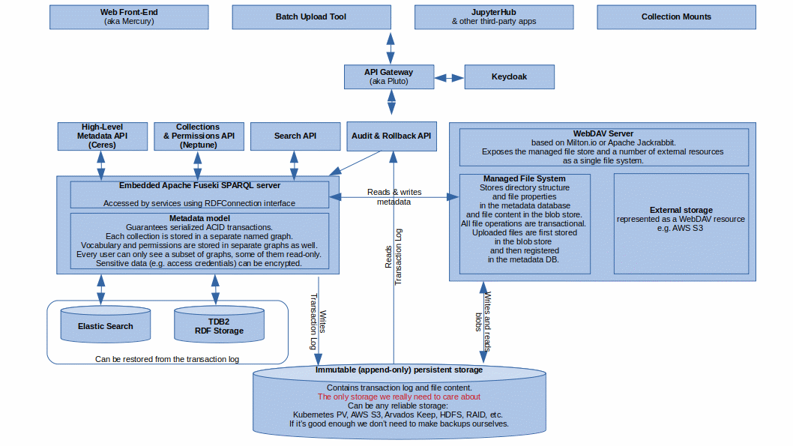

# A Proposal for Improving Data Integrity Guarantees

*Context*

Currently data and metadata in Fairspace is dispersed over a variety of storages.
Even if we exclude Keycloak and JupyterHub from the picture, we will have to deal with at least four different persistent storages. None of them contains full information and can act as a single point of truth. Each has its own transaction model. 
At the moment we don’t have any distributed transaction mechanism or any other solution or plan how to address this problem.  
Data loss prevention would require a custom solution for each and every storage. 
The absence of a unified data model also contributes to the architectural complexity. Most services have bi-directional data dependencies on each-other and have to use multiple APIs (REST, JSON-LD, SPARQL, WebDAV).
There’s no way to go back in time and to re-run your workflow with exactly same data or to see a difference between two versions of a dataset. 
We need some mechanism preventing accidental or malevolent deletion or modification of files and metadata and don’t have any way of recovering lost data. 
A backup and restore solution is a must-have. Having multiple persistent storages would require implementing such a solution for each of them. 

*Decision*

1. Limit persistent data managed by Fairspace to two types: files and RDF metadata. Move all data currently stored in SQL databases to the metadata database. 
2. Store physical files in some kind of immutable, append-only (content addressable?) storage (S3, Arvados Keep, etc). Each version of a file would be stored forever. Of course, we will need to make sure that the underlying file storage is failure proof, but there's a plenty of options for that.
3. Store logical directory structure in the metadata database. File's visibility is controlled by the metadata. One file version could be shared between (mounted into) multiple directories. 
4. Use serializable ACID transactions provided by the metadata storage for file operations. Such operations as directory copying should result in one transactional update of te metadata storage. File uploads will first save data to the file storage and then mount the uploaded files into the directory structure stored in the metadata database. Failed uploads shall remain invisible to the users
5. Save metadata transactions to a persistent log, which could be stored on the same file-storage as data files. Each transaction will be stored in a separate blob. There’s no need to store the metadata database itself, as it’s mere a snapshot of the transactional log.
6. Every write transaction effectively consists of two lists, namely of deleted and added statements. That makes reverting of a committed historical transaction as simple as creation of a new transaction with the two lists swapped.
7. Avoid tight coupling between Jena and the high-level APIs and other services by using universal client-side APIs such as RDFConnection.

  

*Status*

Accepted

*Consequences*

* A full rewrite is needed
* The proposed solution will simplify the data model of Fairspace, make it more metadata-centric, and provide strong data integrity guarantees, i.e. serializable ACID transactions for both metadata and file operations.
* Serializability of metadata transactions and immutability of the file storage will make it very easy to implement such features as backups, recovery, rollbacks, audit and even time travelling.
* We will be locked to the single metadata database. When adding new functionality, everything has to be stored in the same database, or all consistency benefits of this solution are gone.
* Using a schemaless database with structured data will require addition of validation logic in the application layer.
* The fact that most of the services will highly depend on the metadata store can cause problems with scalability and make development or deployment of a single service more difficult.
* The storage requirements can become much higher if many versions of every file will be stored. The transaction log should in fact take less space than the database itself. 
* Performance could be affected because there is a bottleneck with the single database and strict transactions
 

