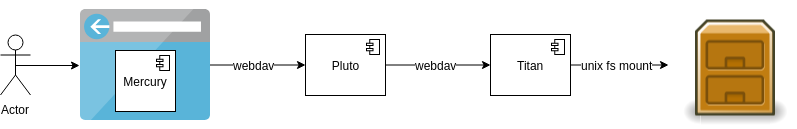
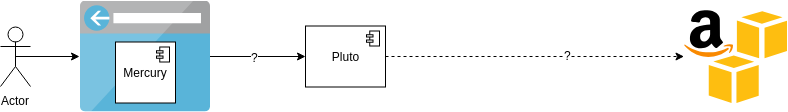

# Integrate external storages via webdav

* **Status**: accepted

* **Context**: At the moment we store all data (files/directories) in fairspace on the local filesystem. We have a storage service (titan) which exposes the data over WebDAV. This webdav is used by the frontend as well as by other parties. 
  
  
  
  However, instead of using the local filesystem, we also want to expose data from other storage systems, such as S3 buckets. This allows users to add metadata to those files. Preferably, the integration would be transparent to the user.  However, the S3 system does not expose a WebDAV API. The question is how to integrate the data from S3 into Fairspace.

  
  
* **Decision**: integrate external storages via webdav

  We will add external filesystems as a virtual filesystem within Titan (or a clone). 
  This means that certain paths on the virtual filesystem (in titan) would not point 
  to a directory on the physical filesystem, but to an S3 bucket. 

  
  
  Titan would itself contain logic to convert Webdav commands into Amazon S3 commands. 

* **Consequences**: 

  This level of abstraction allows the end user to transparently use either type of 
  collections, and can be extended to other types of collections as well (e.g. azure).
  
  Also, the authorization on collections can be enforced on external systems in the same
  way as on local collections. 
  
  Finally, integration from other systems with Fairspace (e.g. Jupyter) does not have to 
  be changed. 
  
  However, it brings some additional complexity to Titan where Webdav commands should 
  be translated to S3 commands. Also, this translation may hurt performance.

* **Limitations**
  * S3 buckets consist of blobs instead of files. The blobs usually have names with path separates, to simulate a filesystem like structure. However, it is important to note that these concepts are different. One apparent limitation is that S3 does not allow for empty directories to be created, as 'directories' only exist as a result of the names of the stored blobs (e.g. storing a blob with the name `/my/files/test.png` would imply that there is a root directory `/my` and a subdirectory `/my/files`)
  * S3 buckets to not allow append operations. It can only download a file, modify it and upload a new file. This problem becomes apparent when looking at JupyterHub. When editing a notebook in Jupyter, it will try to append to the file every few seconds, which is very inefficient and causes a lot of network traffic.
  * S3 provides a mechanism to replicate data over different availability zones and to allow users to access the data from an endpoint with low latency. When proxying S3 data through fairspace, we effectively disable this mechanism, as the data will always be passed through our own servers (which are currently not distributed). 
