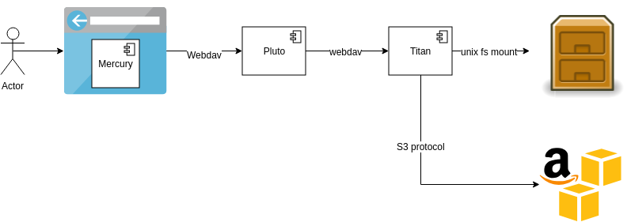

# Store authentication for external storage backends per collection

* **Status**: accepted

* **Context**: We are about to [integrate different storage backends via Titan](006_implement_external_data_storages.md).
  
  
  
  To accomodate for this, we need to store credentials for the backend systems. There are several options 
  to store these credentials:
  - one set of credentials for the full system
  - one set of credentials per collection
  - one set of credentials per user
  
* **Decision**: store one set of credentials for each collection that points to an external storage backend.

  This way Fairspace can access the files in the external system with the credentials provided
  by the creator of the collection. The advantage is that it is a fairly simple solution, and 
  the fairspace authorization layer can be used to share data with others. 
  
  Another advantage of this approach is that it is easier to handle a situation where a customer or 
  research group uses separate accounts for separate parts of the storage (e.g. different buckets)
  
  The downside of this would be that our system has full access to the data in the storage backend, 
  which may not be acceptable for customers. 
  
  Auditing for these files must be done within Fairspace, as the audit logs in the external system 
  would always show the same credentials.
  
* **Consequences**: 

  The credentials provided for a collection should be stored safely within our system
  
  The users should be instructed to provide credentials that are specific to fairspace and
  limited to that part of the storage that is involved (e.g. 1 bucket). That reduces the
  damage in case something happens to the credentials.
   
  Fairspace has full access to the data in the storage backend, which may not be acceptable 
  for customers.
