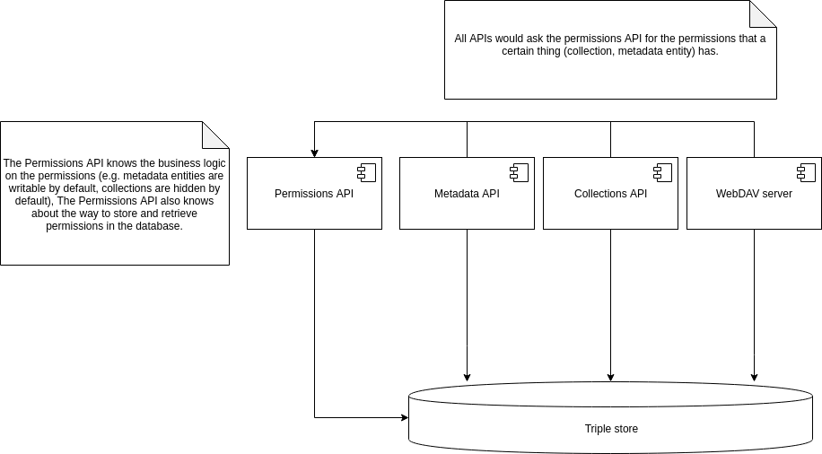

# Enforcing and managing permissions model

* **Status**: proposed

* **Context**: From the business requirements it follows that we want to 
  apply permissions on the level of collections, as well as on the level of 
  metadata entities. These permissions must be stored somewhere, enforced
  by the system and there should be a way to manage them. 
  
* **Forces**:
  * The logic for enforcing permissions contains quite some business logic
  * The database layer only knows about triples and should not know much about 
    the business logic
  * It is important to provide loose coupling between services  
  * Logic about how to store permissions is known in only one place
    and not exposed to other services

* **Decision**: there will be a separate API that has all business logic on the
  permissions and knows how to store them.

  

* **Consequences**: 
  * the permissions are abstracted away from the 
    other parts of the application. This loose coupling improves the 
    stability and quality of the system.
  * Making calls via the permissions API will introduce some overhead
    (latency) in all API calls, when comparing it to direct lookups in
    the database. 
