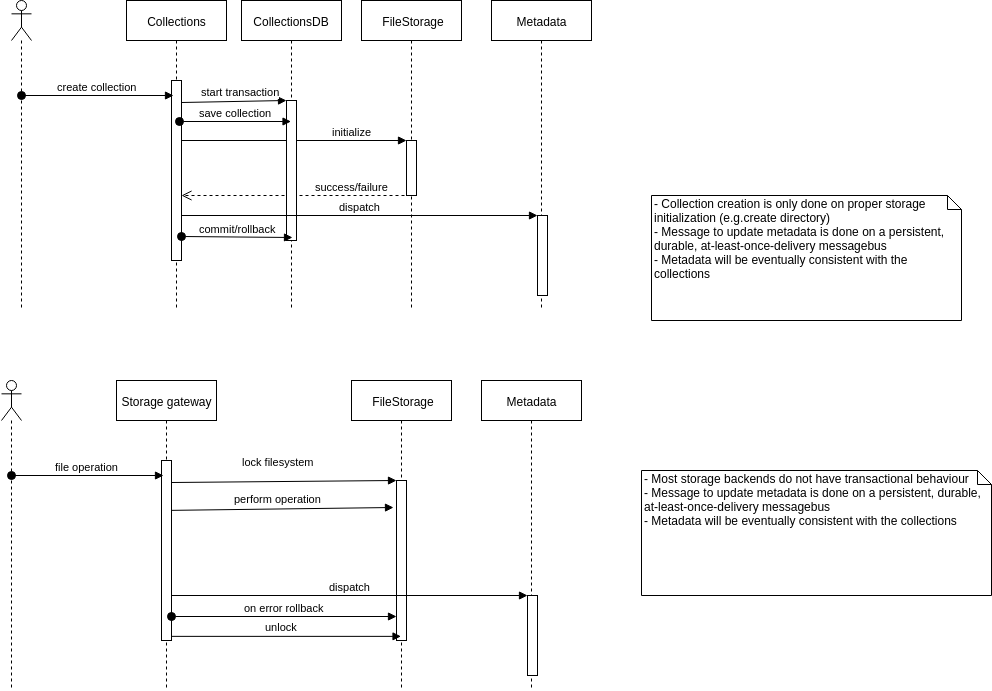

# Consistency and data integrity

* **Status**: rejected

* **Context**: We have several different storages and we do want to make sure that the 
  data in different systems is consistent. Due to the very nature of distributed systems, 
  there are choices to be made here. What level of consistency do we want to provide. 
  
* **Eventual consistency** I would argue that between the file storage and the metadata we can work with eventual 
  consistency (also used in well-known systems like Cassandra and CouchDB). This means 
  that "if no new updates are made to a given data item, eventually all accesses to that 
  item will return the last updated value." In our context, this means that if a file 
  operation is being performed, eventually the metadata will be updated along with it. 
  
  Effectively this could mean that at some point in time that the file system has been 
  updated, but the metadata has not yet been updated. Please note that the user will 
  hardly ever notice any issues with this. 
               
* **Decision**: Implement strict consistency between collections and file storage if 
  possible. Implement eventual consistency for metadata updates based on changes in 
  collections or storage.               
               
  There are 2 main operations that require attention with regards to consistency, 
  as they span multiple storages. Collection operations (e.g. collection creation) and 
  file operations. Consistency can be provided as described in the diagrams below. 
  Please note that it will ensure eventual consistency between the metadata on the 
  one hand and the collections/file storage on the other hand.
  
   
 
* **Consequences**: 
  * using these principles means that the proposal to [integrate all data in a single datasource](../005_data_integrity.md)
    will not be followed.
  * This proposal does not include a way to undo accidental or malicious operations.
  * Other users could see partially uploaded files or directories that are currently being moved.
   
