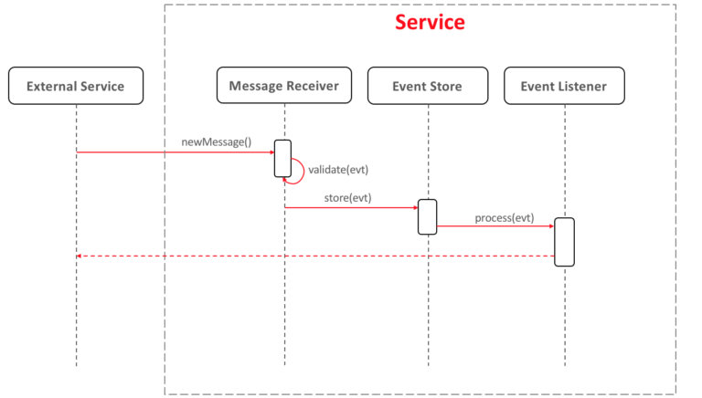

# Backups

* **Status**: rejected

* **Context**: A backup strategy is needed because we want to recover from 
  'disasters' (e.g. failing hardware or inconsistent data due to software bugs). 
  As a consequence of storing the data in storages provided by cloud providers, 
  we can leverage their safeguards. For example, azure premium disks are already 
  3-way replicated, and cosmos db provides redundancy and high availability by itself. 
  These measure will solve the large majority of failures covered by a backup strategy.
               
  However, this replication and redundancy does not help in case there are accidental 
  bugs in our system that cause inconsistent data. Nor does it work automatically on
  on-premise installations. 
  
* **Solution**: An implementation to solve this issue could use the concept of Event Sourcing. 
  Event sourcing is a pattern where every change to the system is stored in a sequential log, 
  before it is actually applied to the database. As this log contains all the operations that 
  have changed the state of the application, it can be used to replay the events when anything 
  happens to the data. This includes the possibility to revert accidental or malicious updates.
  
  
  
* **Decision**: Do not use event sourcing as backup strategy. On a high level, the idea of 
  event sourcing seems very elegant and simple. However, it has a number of important drawbacks
  
  * When updating the application, it may not be trivial to replay 'old' events and end up 
    with the same state. Non-trivial measures must be taken to handle this situation, which complicate the solution.
  * Implementing a consistent sequential logs comes with concurrency issues, given that we
    want to be able to [run multiple instances of our services](008_architecture_principles.md)   
  * It can be costly to replay a full event log (if there are many operations), so in most 
    implementations it is suggested to take snapshots at regular intervals. 
    This would mean we need to implement both backup/restore and event sourcing.
  * When replaying events, no updates should be propagated to systems out of our control 
    (e.g. notifications). This requires additional logic
  
