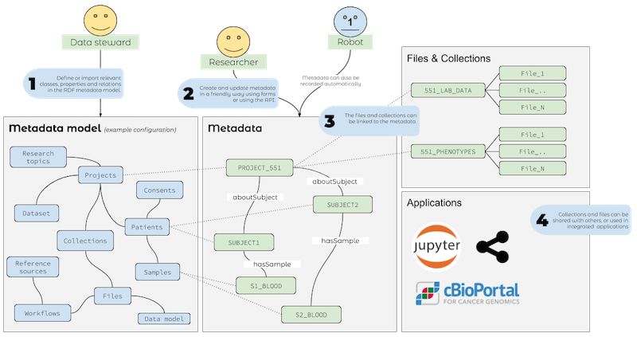

Fairspace metadata overview
===========================

Fairspace is designed to have a flexible RDF metadata layer, that should be configured to fit 
the business Fairspace should support. 

The intended user flow is this:

#.  a data steward or subject matter expert has to determine the use case that should be covered 
    with the Fairspace metadata layer. This means they have to identify classes, properties, and 
    relations that should be part of the metadata model.

#.  based on this model data steward can then configure a workspace with the conceived metadata 
    model. This is done by creating the appropriate *shapes* from the workspace user interface (or, 
    in the future, by importing them from a shapes library). The model is refered to 
    as `The Vocabulary`_.

#.  any user can record metadata according to the configured metadata model. This can be done
    manually via the generated forms in the user interface, or programmatically for the API. 
    See more at the `Metadata`_ section. 
    
#.  Entities in the metadata layer can be linked to files and collections index by the workspace or 
    other external data assets.

The Vocabulary
--------------

Every workspace has to have a configured metadata model, which is a collection of SHACL shapes.
A SHACL shape constrains the attributes and values a RDF valid resource of a particular type 
is allowed to have (see `SHACL specification <https://www.w3.org/TR/shacl/>`_).

Fairspace uses the SHACL shapes for two purposes:

- automatic form generation

- validation of metadata provided (via forms and JSON-lD API)

.. note:: [TODO] 

  * add comments to explain statements
  * link to meta-vocabulary
  * link to system-vocabulary

.. literalinclude:: turtle/turtle_example.ttl
    :language: turtle
    :linenos:

This very simple example vocabulary has the following relations:

Source: `link <https://docs.google.com/drawings/d/1tSOR_fP18OBCGe9bjKsY6AiAK3H9BXHrJJAPEiyA3Fc/>`_

Metadata
--------

.. note:: [TODO]

  * Elaborate on UI impact
  * Add metadata form widgets

